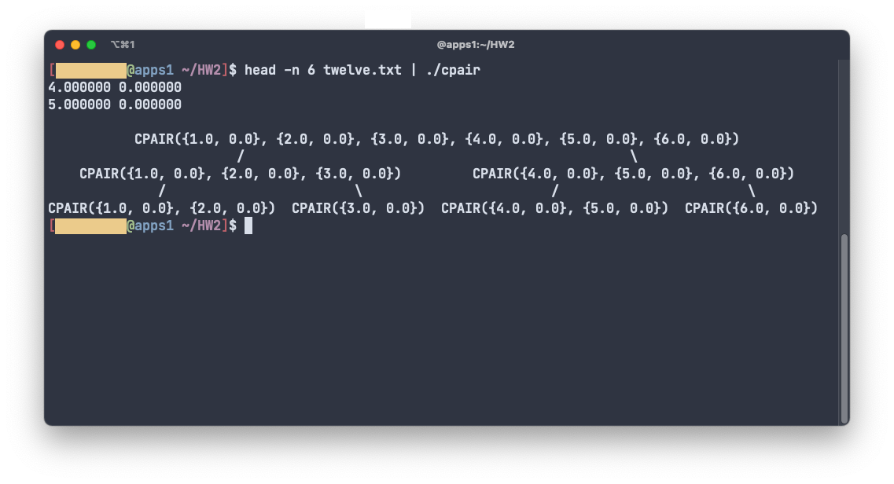

# 2-cpair-flofriday

## Rating
**Points received:** 25/20 (5 Bonus points)

Tutor said that the error-handling is tedious and should be done in a central
place.

## About this solution
This solution also implements the tree for the bonustask. While the exercise 
description only requires the tree to work for a depth of three, my
implementation works for any size of inputs.
